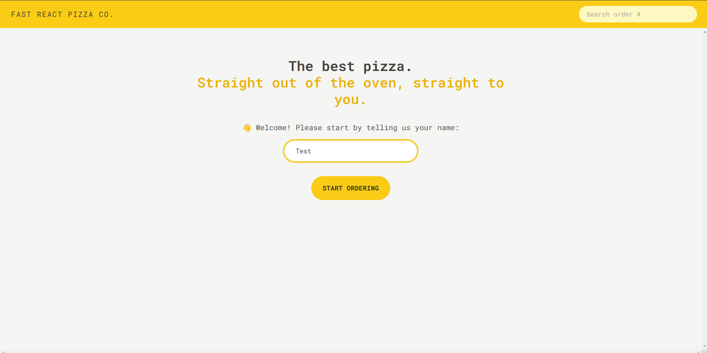
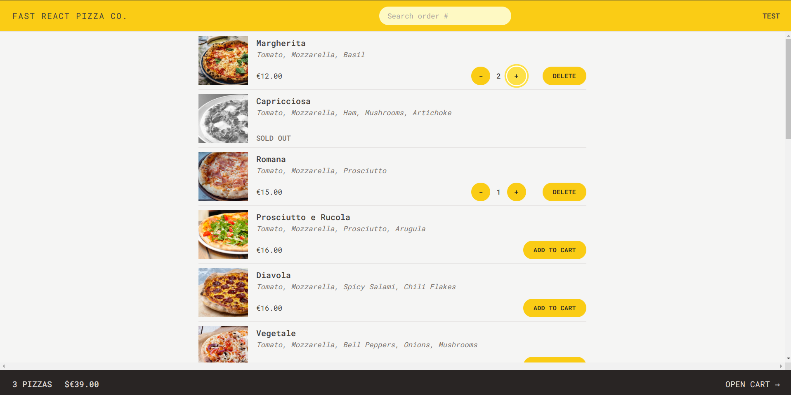
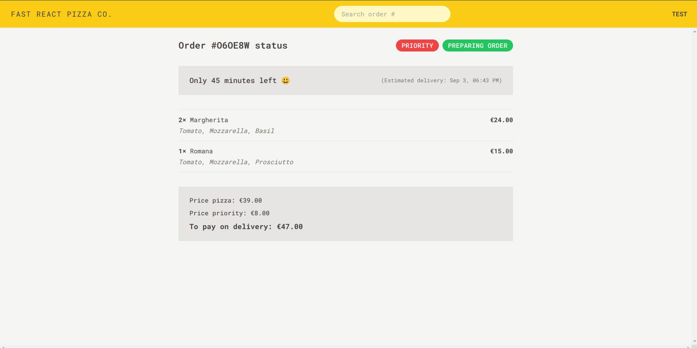

# Pizza Delivery App

A pizza delivery app built with `React, Redux, and Tailwind CSS` would be a modern web application that allows users to:

1. Browse a menu of pizzas with images and descriptions.

2. Customize their pizza orders by selecting toppings, size, and quantity.

3. Add pizzas to a shopping cart, view the cart contents, and adjust quantities or remove items.

4. Provide delivery information and place orders.

5. Track the preparation of the order, including the delivery, and estimated arrival time.

The app would use `React` for building the user interface, `Redux` for managing state (e.g., cart contents, order status), and `Tailwind CSS` for responsive and visually appealing styling. It might also integrate with a backend server for handling order processing and user authentication.

## Here are some key features and aspects of such an app:

### **User-friendly Interface**

### **Menu Selection**

### **Customization**

### **Shopping Cart**

### **Order Placement**

## Here's a look of the website

# Getting Started with Create Vite App

## Available Scripts

In the project directory, you can run:

### `npm run dev`

Runs the app in the development mode.\

The page will reload when you make changes.\
You may also see any lint errors in the console.

### `npm run build`

Builds the app for production to the `build` folder.\
It correctly bundles React in production mode and optimizes the build for the best performance.

The build is minified and the filenames include the hashes.\
Your app is ready to be deployed!

### `npm run preview`

locally preview production build

## Scaffolding Your First Vite Project

### With NPM:

> $ npm create vite@latest

### With Yarn:

> $ yarn create vite

### With PNPM:

> $ pnpm create vite
